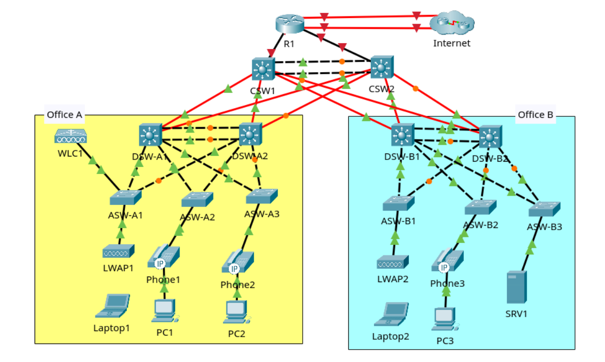

> Part 1 - Initial setup
> 1. Configure the appropriate hostname on each router/switch.
> 2. Configure the enable secret jeremysitlab on each router/switch. Use type 9 hashing if available; otherwise, use type 5.
> 3. Configure the user account cisco with secret ccna on each router/switch. Use type 9 hashing if available; otherwise, use type 5.
> 4. Configure the console line to require login with a local user account. Set a 30-minute inactivity timeout. Enable synchronous logging.

_Don't forget to `copy run start` on each device after config!_